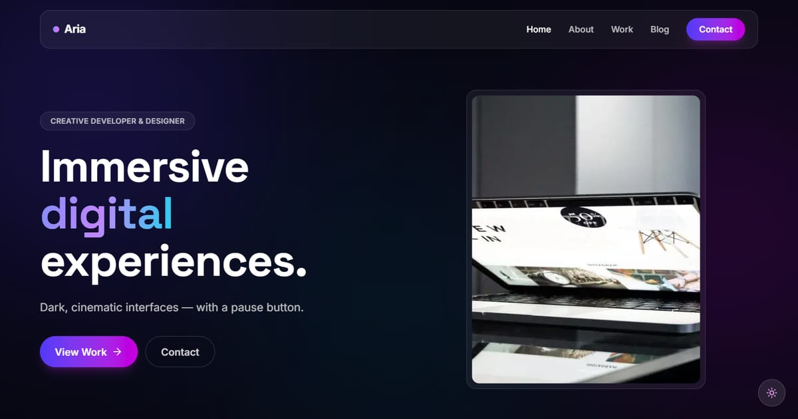

# Aria — Creative Developer & Designer

Portfolio template for Aria, a fictional creative developer: dark, cinematic case studies that link to six live demo sites, plus articles on motion, contrast, and small algorithms.

**Demo live:** https://portfolio-aria-pearl.vercel.app



> Template portfolio dengan persona fiktif. Semua proyek di dalamnya adalah demo live dari koleksi yang sama; tidak ada klien, testimoni, atau logo merek sungguhan. Formulir kontak hanya demo dan mengatakannya.

## Konsep

Persona fiktif Aria, creative developer. Kaca gelap (glassmorphism) dengan aurora beranimasi, tekstur grain, dan judul Space Grotesk; mode terang membalik kaca menjadi terang tanpa kehilangan aksen gradien.

## Isi

- **6 studi kasus** (`/work/[slug]`): tantangan, yang dikerjakan, hasil, dan tautan ke situs live-nya.
- **3 artikel** (`/blog/[slug]`) tentang keputusan desain di proyek-proyek tersebut.
- Statistik beranda dihitung dari isi situs (jumlah proyek, layanan, artikel).
- Halaman 404 bergaya sendiri, judul halaman berpola `Halaman — Aria`, dan sitemap memuat setiap studi kasus dan artikel.

| Studi kasus | Demo live |
| --- | --- |
| Lumora | https://properti-lumora.vercel.app |
| Zychrome | https://landing-zychrome.vercel.app |
| Lumicast | https://landing-lumicast.vercel.app |
| LuxeElectro | https://landing-luxeelectro.vercel.app |
| c1ph3r | https://linkinbio-cipher.vercel.app |
| Raka Wijaya | https://linkinbio-pulse.vercel.app |

## Halaman

`/` · `/about` · `/work` · `/work/[slug]` · `/blog` · `/blog/[slug]` · `/contact`

## Gambar & kredit

- `public/images/work/*.webp` — tangkapan layar demo live di tabel atas (karya koleksi ini sendiri).
- `public/images/hero.webp` — "Office Work" oleh Jens Kreuter, [StockSnap](https://stocksnap.io/photo/office-work-0SQT0QS773), lisensi CC0.
- `public/images/about.webp` — "Office Work" oleh Vilmos Vagyoczki, [StockSnap](https://stocksnap.io/photo/office-work-A4XAPP3ZTK), lisensi CC0.

## Teknologi

- Next.js 15.5 (App Router) dan React 19
- Tailwind CSS v4
- JavaScript
- Framer Motion, Lucide (ikon), next-themes (mode gelap/terang)
- Font: Inter, Space Grotesk (next/font)
- SEO: metadata per halaman, Open Graph, JSON-LD (WebSite), sitemap.xml, dan robots.txt

## Menjalankan secara lokal

```bash
npm install
npm run dev
```

Buka http://localhost:3000. Untuk build produksi: `npm run build` lalu `npm start`.

---

Bagian dari koleksi 7 template portfolio personal di [PortalPorto](https://portal-porto-neon.vercel.app). Dibuat oleh [PintuWeb](https://www.pintuweb.com), jasa pembuatan website.
